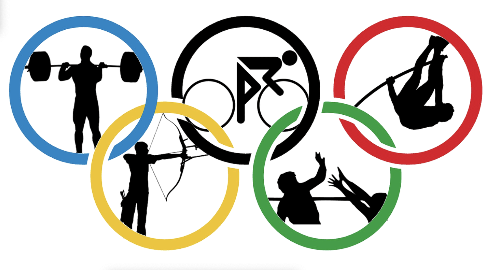
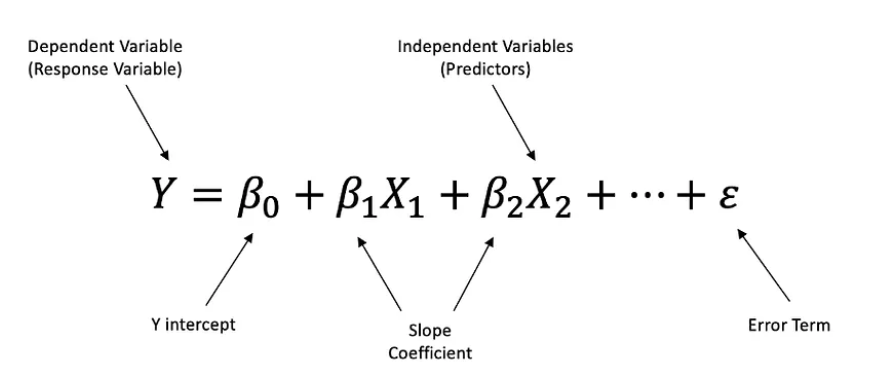

# **Week 3 | Project: Olympic Dataset**

## **Project Overview**

What influences a country's Olympic success? 

This study looks at how economic factors (like a country’s wealth), geographic factors (like being the host country or time zone differences), and sporting factors (like how specialized a country is in certain sports or the age of medal-winning athletes) affect the number of medals won. 

## **Datasets and Hypothesis**

### **Raw Datasets**

* **Olympic Data **(athlete_events.csv)
    1. **Source:** [Kaggle](https://www.kaggle.com/datasets/heesoo37/120-years-of-olympic-history-athletes-and-results/data) - Originally scraped from[ sports-reference.com](http://sports-reference.com) in May 2018 
    2. **Shape:** 271,116 rows | 15 columns 
* **GDP Per Capita **(gdp_capita_final.csv)
    3. **Source:** World Bank Open Data, Bloomberg & International Monetary Fund (IMF)
    4. **Shape:** 195 rows | 34 columns 
* **Timezone Data **(time_zones2.csv)
    5. **Source:** [https://www.timezonegenius.com/capitals](https://www.timezonegenius.com/capitals) 

### **Hypothesis**

#### **Economic Factors**

* Wealthier countries win more medals

#### **Geographical Factors**

* Athletes from the host country won more medals
* Efficiency in turning athlete participation into medals will increase in host country
* Difference in timezone affects athlete performance

#### **Sport Factors**

* Younger athletes are more likely to win medals
* Young medalists are more likely to win again in later Olympics

---

## **Data Wrangling and Cleaning**

### **Olympic Dataset Issues (athlete_events.csv)**

#### **Team**

* Issues with sports teams being mixed with country names (e.g., Toronto Argonauts).
* Some countries enter multiple teams for a single event, labeled numerically (e.g., Ukraine-2, Belarus-1).
* Variability in country participation due to geopolitical factors (e.g., Soviet Union dissolution).

#### **Year**

* 1906 is an invalid year as it was not an official Olympic event.
* No data recorded for years during World Wars.

#### **City**

* Non-English spelling of city names.

#### **Sport**

* Some sports have very few recorded instances (e.g., Basque Pelota, Aeronautics), which are edge cases and no longer part of modern Olympic Games.

#### **Events**

* Duplicated medals per event, as the dataset counts the number of medals won by athletes.

#### Medal

* Null values refer to athletes who did not win medals.
* Discrepancies exist between gold, silver, and bronze medal counts due to:
    * Duplicates that can distort medal statistics.
    * Team sports not having a uniform number of athletes.
    * Isolated cases such as tied events affecting medal counts.
* Medal totals are based on the number of athletes instead of sports. Therefore, countries with medals from team sports appear to have more medals (e.g. 22 medals for winning gold in Men’s football).

### **Solutions for Dataset Issues (athlete_events.csv)**

* Team: 
    * Use National Olympic Committee (NOC) code instead of country names.
    * Focus on the Olympics since 1996 to account for Soviet Union dissolution.
    * Create a blacklist of countries to be excluded in our analysis. (NOC: Drop blacklisted countries ("North Korea", "Kosovo", "Montenegro", "Tuvalu", "Individual Athletes",  "Virgin Islands, British", "Virgin Islands, US", "South Sudan", "Palestine",    "Cook Islands", "American Samoa", "Swaziland", "Refugee Team")
    * Add ‘regions’ column with Country names, merging with “noc_regions.csv” on NOC name.
* **Medal**: 
    * Update null values to "No Medal".
    * Deduplicate medals from team sports - only count medals based on sport.
* **City**: 
    * Standardize all city names to English.
* **Events**: 
    * Create a new dataset (`olympic_podium`) that only records events and which country won each medal by year.
* Season: 
    * Filter by summer, so we exclude winter results from our dataset.

### **GDP Dataset Issues (gdp_capita_final.csv)**

* Hard to fill null values. Some countries have estimations (official sources) for some years instead of the real gdp per capita or 
* A lot of countries to filter in the sources websites with regions and areas not considered a country (e.g. West Africa, East Asia, or others in our controversial countries list)

### **GDP Dataset Solutions (gdp_capita_final.csv)**

* Drop blacklisted countries
    * "North Korea", "Kosovo", "Montenegro", "Tuvalu", "Individual Athletes",  "Virgin Islands, British", "Virgin Islands, US", "South Sudan", "Palestine",    "Cook Islands", "American Samoa", "Swaziland", "Refugee Team".
* Merge Olympic and GDP dataframes based on ‘region’
* Grouping the countries (to compute the gdp per capita effect as a whole)

### **Timezone Dataset Issues (time_zones2.csv)**

* Some countries have more than one time zones (i.e: USA, Canada or Russia) → Take into account capital cities time zone in our analysis
* Some countries have not whole difference time hour (i.e: India +5.30) → create range to ease the read information
* Drop blacklisted countries
    * "North Korea", "Kosovo", "Montenegro", "Tuvalu", "Individual Athletes",  "Virgin Islands, British", "Virgin Islands, US", "South Sudan", "Palestine",    "Cook Islands", "American Samoa", "Swaziland", "Refugee Team".
* Merge podium and time zones files in one
* Use function to make range of time zones difference in abs hour
* Grouping the countries by range and count of medals per range
* Massive change in minutes column to be available to sum

### **Overview of Cleaned Datasets **

* ‘Podium_1996_2016.csv’
    * Contains summer olympic data for **only medalists **with** **deduplicated medal counts for team sports.
    * Based on athletes_events.csv and NOC_regions.csv
    * Year column: Filtered 1996 - 2016
    * Season column: Filtered for ‘Summer’
    * Teams: Deduplicated - only 1 athlete shown per team
    * Medal: Remove “No Medal” athletes (only includes athletes with medals)
    * NOC: Drop blacklisted countries
    * Imported in notebooks as: "olympic_podium" \

* ‘teams_not_duplicated_summer_olympics_1996-2016_deduplicate_team_medals.csv’
    * Contains summer olympic data for** medalists and non-medalists **with** **deduplicated medal counts for team sports.
    * Based on athletes_events.csv and NOC_regions.csv
    * Year column: filtered 1996 - 2016
    * Season column: filtered for Summer
    * Teams: Deduplicated - only 1 athlete shown per team
    * Medal: Includes medalists and non-medalists
    * NOC: Drop blacklisted countries
    * Imported in notebooks as: "olympic_data2" \

* ‘gdp_capita_final.csv’
    * Contains total GDP per capita by country per year in current USD.
    * Filtered for blacklisted countries
    * Sourced from World Bank Open Data, Bloomberg & International Monetary Fund (IMF)
    * Imported in notebooks as “gdp_per_capita” \

* ‘time_zones2.csv’
    * Contains country and timezone data based on capital city.
    * Sourced from [https://www.timezonegenius.com/capitals](https://www.timezonegenius.com/capitals) 
    * Filtered for blacklisted countries
    * Imported in notebooks as “time_zones”

---

## **Exploratory Data Analysis**

### Economic Factors

* 
Aggregation of the GDP per capita

    * To smooth out economic fluctuations, the aggregated GDP per capita in gdp_capita_final.csv is calculated for each Olympic year. This is done by **aggregating the GDP values from the previous four years.**
    * This aggregation** **is done with a new dataframe called agg_gdp_per_capita.
* Medal Count and GDP information combined
    * The agg_gdp_per_capita is processed to **add the number of medals won by each country**. We extract the olympic information from teams_not_duplicated_summer_olympics_1996-2016_deduplicate_team_medals.csv.
    * Merging this information with the full list of participating countries to include those with zero medals.
* Visualization of GDP vs. Total Medals
    * **Two scatter plots are created to visualize the relationship** between GDP per capita and the total number of Olympic medals won. 
    * A scatter plot displaying all countries, showing a not clear relationship between economic power and Olympic success.
    * A refined scatter plot focusing only on medal-winning countries, providing a clearer insight into how economic strength moves with performance.
    * To improve readability, the x-axis is set to a **logarithmic scale to account for vast differences in GDP values**. A grid is applied to enhance visualization.
    * A regression scatter plot per Olympic year is done for a better understanding of the shape of the relation between both variables
* Analysis of Mean GDP per Capita and Medals
    * To assess real comprehensive numbers, the **average GDP per capita for each country** is calculated over the studied period. The number of medals won is averaged accordingly.
    * A **correlation coefficient** is calculated to quantify the relationship between GDP per capita and total medals. (0,18)
    * A horizontal bar chart displaying mean GDP per capita for each country. The average numbers of medals are displayed in circles with different sizes.

### Geographical Factors

* Olympic Medal Count
    * Aggregation of medals (Gold, Silver, and Bronze) for selected countries (NOCs) over the years. The aggregation includes information about the host city, region, and total medals won.
* **Medal Performance Conversion rate (Number of athletes winning medals / Total athletes participated)**: 
    * Each combination of 'Year', 'NOC', and 'City' is unique.
    * Medal counts (Gold, Silver, Bronze, No Medal) grouped by Year, NOC, and City, created “medal_data”.
    * To measure medal efficiency, count the number of athletes who won medals rather than the number of medals themselves (as team events involve multiple athletes contributing to a win).
* Performance Change in percentage point:
    * Extracts medal performance data for each host country in both its non-host and host years, created “host_data_medal_rate”
    * Determines the percentage-point difference between the host year and the non-host year.
* GMT Host country:
    * Following the Greenwich Mean Time, a new column has been set to determine the Universal Time Coordinated of the host country. 
    * That column has been set as absolute values. (i.e a value equal of “2” means that there is a difference of two hours either positive or negative from the UTC +00.00)
* GMT Athlete country:
    * Following the Greenwich Mean Time, a new column has been set to determine the Universal Time Coordinated of the capital city country where the athlete comes from. 
    * That column has been set as absolute values. (i.e a valuel equal of “2” means that there is a difference of two hours either positive or negative from the UTC +00.00)
* Time difference:
    * Difference in hours and minutes from the GMT Host country and GMT Athlete Country. 
    * That column has been set as absolute values. 
* Range Time difference:
    * Function create_range_time has been defined to create a new column whose time difference will be grouped in a range of two hours. 

### Sport Factors

* Young Athletes Win More Medals:
    * Aggregated the Olympic dataset and found the **median age of medalists (25 years old)** as a key benchmark.
    * Found a **negative correlation (-0.55) between age and medal count**, indicating younger athletes tend to win more medals.
    * **Scatter Plot with Regression**: Highlighted the decreasing trend of medals with increasing age. \

* Younger Athletes with Medals Have a Higher Repeat Rate:
* Filtered dataset to focus on **medalists vs. non-medalists** and **age groups** (Under 22 vs. Over 22).
* Calculated **total athletes, repeat medalists, and repeat medal percentages** for each group.
* **Pie Charts**: Compared the proportion of repeat medalists within different age and medal groups.

## **Key Insights**

### Economic Factors

#### Extreme Cases in GDP per capita affect medal count

* The analysis reveals that while there is a weak positive correlation (approximately 0.2) between GDP per capita and Olympic success, the relationship is not as strong as initially expected.
* The poorest countries tend to win significantly fewer medals compared to the wealthiest nations. This suggests that a minimum level of economic development is necessary for Olympic competitiveness.

#### High Variability Within Income Groups

* Among low-GDP countries, there is no clear pattern explaining why some nations win more medals than others. The distribution of medals in this group is highly dispersed, indicating that factors other than GDP play a crucial role.

#### Diminishing Returns for Wealthier Nations

* Once a country surpasses a certain economic threshold, increases in GDP per capita do not lead to a proportional rise in Olympic medals. This suggests that after reaching a sufficient level of wealth, other factors—such as sports infrastructure, government policies, culture, and historical athletic performance—become more influential in determining Olympic success.

### Geographical Factors

#### Increase in Medal Count for the Host Countries

* The data reveals that hosting the Olympic Games generally leads to an increase in medal count for the host countries, with varying degrees of growth:
    * **Brazil (2016)** saw a 12% increase.
    * **UK (2012)** experienced a 35% rise.
    * **China (2008)** had the highest increase at 59%.
    * **Greece (2004)** saw a 23% growth.
    * **Australia (2000)** experienced a 41% rise.

In all cases, the host country performed better during the games, likely due to home-field advantage, increased national pride, and investments in sports infrastructure. China’s 59% increase stands out as the most significant, reflecting its strong focus on Olympic success.

#### Increase in Gold Medal Count for the Host Countries

* The data highlights a clear trend of increased gold medal counts for host countries during their respective Olympic Games:
    * **China (2008)**: Increased from **32** to **51** gold medals, a significant rise of **59%**.
    * **Brazil (2016)**: Increased from **3** to **7** gold medals, a **133%** rise.
    * **UK (2012)**: Increased from **19** to **29** gold medals, a **53%** increase.

These increases suggest that hosting the Olympics often provides a boost in gold medal performances, likely driven by home advantage, national pride, and investment in athlete preparation and infrastructure. China’s jump of 19 additional gold medals in 2008 stands out as particularly remarkable.

#### Decline in Medal Conversion Rate During Olympic Hosting

* **Increased Athlete Participation, Decreased Efficiency: \
**While more athletes from the host nation compete, the **medal conversion rate** (medals won per athlete) tends to decline during the host year.
* The data shows that hosting the Olympics often leads to a drop in a country's medal conversion rate. Brazil in 2016 saw the largest decrease, from 24% to 11%, while the UK (2012) and Greece (2004) also experienced declines. Australia (2000) had a small drop, and China (2008) saw no change. Overall, hosting appears to reduce the efficiency of turning athlete participation into medals, although the impact varies.
* **Result: \
**Hosting the Olympics is associated with a **decrease in the overall medal conversion rate**, suggesting lower efficiency in turning athlete participation into medals.

Organizations may need to focus on better training and preparation for their athletes. There's a need to refine athlete selection to ensure those competing are best positioned to perform at a high level, rather than simply expanding participation numbers.

#### Ranges with less timezone difference sum the majority of medals

* The data reveals that historically countries which have suffered less difference in time between the host country and their local time, have experienced better results.

<table>
  <tr>
   <td>
Range Time Difference
   </td>
   <td>Total medal count
   </td>
  </tr>
  <tr>
   <td>[0-2]
   </td>
   <td>2637
   </td>
  </tr>
  <tr>
   <td>(2-4]
   </td>
   <td>1708
   </td>
  </tr>
  <tr>
   <td>(4-6]
   </td>
   <td>1028
   </td>
  </tr>
  <tr>
   <td>(6-8]
   </td>
   <td>923
   </td>
  </tr>
  <tr>
   <td>(8-10]
   </td>
   <td>208
   </td>
  </tr>
  <tr>
   <td>(10-12]
   </td>
   <td>40
   </td>
  </tr>
  <tr>
   <td>(12-14]
   </td>
   <td>13
   </td>
  </tr>
</table>

    	

These results suggest that there are factors related with time that can affect the performance of the athletes. Athletes in which countries do not have or do not have many differences in time zone performance better in the Olympics and they do not suffer jet lag or they do not have to readapt their body after a long travel.

### Sport Factors

#### Younger Athletes Are More Likely to Win Medals

* The median age of medalists is 25 years, indicating that Olympic success is more common among younger athletes.
* A negative correlation (-0.55) between age and medal count suggests that as athletes age, their chances of winning medals decrease.
* Possible Explanation:
    * Younger athletes are likely less prone to injury, have faster reaction times, and more flexibility and stamina. These attributes are required in many Olympic sports to succeed.

#### Younger Athletes with Medals Have a Higher Repeat Rate

* 47.4% of athletes under 22 years old who won a medal went on to win multiple medals. This is significantly higher than the 19.1% repeat rate for athletes over 22 years old with medals.
* Possible Explanation:
    * Young medalists likely continue competing at a high level, gaining experience and improving over multiple Olympic cycles.
    * Sports like swimming, gymnastics, and athletics often see young breakout stars who continue to dominate in later years.

#### Older Athletes with Medals Have a Lower Repeat Rate

* Only** **19.1%** **of medalists over 22 years old won multiple medals.
* This suggests that as athletes age, their chances of winning additional medals decrease.
* Possible Explanation:
    * Older athletes face increased competition from younger athletes entering the sport.
    * Injuries, physical decline, and retirement may reduce their ability to compete at the highest level across multiple Olympics.

#### Non-Medalists Rarely Become Repeat Medalists

* Only 6.4% of younger athletes and 3.0% of older athletes eventually won a medal in later years.
* Possible Explanation:
    * Winning an Olympic medal is extremely difficult, and the majority of athletes never reach that level.
    * Limited Olympic opportunities (only every 4 years) mean many athletes may never get another chance to medal.

---

## **Major Obstacles**

**Obstacle 1: Large & Complex Dataset**

* Data covered many countries, athletes, and years, with external factors like wars, political changes (e.g., Soviet Union breakup), and missing data.
* Challenges: Inconsistent participation, missing economic data, and variations in country representation over time.

**How We Overcame It:**

* Focused on data from 1996 to 2016 – ensured a more consistent set of participating countries. 
* Analyzed only Summer Olympics – included more countries with diverse economic, geographic, and cultural backgrounds.
* Blacklisted some countries with missing data due to war or political instability.

**Lessons Learned:**

* Narrowing the dataset improved reliability and consistency in our analysis.
* Recognizing external factors like political changes is crucial in global sports analytics.

**Obstacle 2: Defining the efficiency on winning medals**

* Had to decide how to efficiency on winning medals:
    * Total medals per country (simplest approach, ignoring the number of athletes participated).
    * Total medals by sport  (only one medal will be counted, not fair for team sport).
    * Medal conversion rate  (taking account for all the athletes who contributed on winning medals).

**How We Overcame It:**

* Calculated medal conversion rate  – how many of a country's athletes win medals compared to how many athletes they send to the competition. A higher rate means more athletes win medals.
* Calculated medal performance (efficiency) – helped identify countries that are highly effective in winning medals.

**Lessons Learned:**

* Clarity in defining success metrics is key to ensuring meaningful insights.
* Considering different perspectives (e.g., absolute vs. efficiency-based measures) provides a more comprehensive analysis.

## **Conclusion and Insights**

### **Hypothesis Outcomes**

#### **Economic Factors**

* While GDP per capita does have some impact on Olympic success in the extremes regarding wealth, it is far from being the dominant factor. The data suggests that while extreme poverty can limit a country's ability to compete at the highest levels, once a nation reaches a moderate level of economic development, additional increases in wealth do not guarantee more Olympic medals.
* This indicates other elements, such as investment of this GDP in sports, talent identification systems, cultural attitudes towards sports and historical Olympic performance.
* There may be additional socioeconomic and structural factors beyond GDP per capita that affect the number of medals when considering economic factors.

#### **Geographical Factors**

* Host countries tend to win more medals, especially gold medals.
* The findings support that the Olympics is a great opportunity for the host country to enhance its global image, making it more attractive for tourism, investment, and international partnerships.
* The hypothesis predicted that hosting the Olympics would improve a country’s medal conversion rate. However, the findings showed the opposite, with most host nations experiencing a decline in their conversion rates.
* Organizations may need to focus on better training and preparation for their athletes. There's a need to refine athlete selection to ensure those competing are best positioned to perform at a high level, rather than simply expanding participation numbers.
* Difference between time zones is a strong factor in athletes' performances due to jet lag or changes in biology scheduler. If countries have seen their result boost, they should invest on a mobility program so the athletes can travel to host city with the time needed to adjust their biological cycles to the UCT where the Olympics are taking place

#### **Sport Factors**

* Younger Athletes have more potential for growth. Younger athletes not only win more medals but also have a higher likelihood of repeating success. 
* Athletes who start their careers early and win a medal young are in a better position to compete at multiple Olympics and accumulate more medals.
* Investing in youth development programs may increase a nation's long-term Olympic success.

## **Surprising Insights**

#### **Geographical Factors**

* We expected that the home advantage would increase the efficiency for athletes winning the medals. Instead, the data suggests that hosting the Games leads to a decrease in the efficiency of converting athlete participation into medals.

#### **Sport Factors**

* We were surprised to see the variation in peak age for winning Olympic medals across different sports. While athletes in most sports reach their peak around 25 years old, the peak age for some sports like Gymnastics skews towards younger athletes while sports relying less on flexibility and physical strength, like Equestrian or Golf, skews towards older athletes.

## **Next Steps**

The next step in our project is to create a linear regression model to predict the odds that the countries have to win medals in the next Olympics: Los Angeles 2028. 

* 70% of the data will be used to train our model and the 30% will be used to test the reliability of our model.
* Being “X” the independent variable and Y is the dependent variable (the outcome you are trying to predict), three variable will be calculated for our model:
    * **Y intercept**: is the intercept value of (Y) when (X) is zero.
    * **Slope coefficient**: the effect that changing the value of the independent (Xn) variable has on the predicted  value (Y), holding all else equal.
    * **Error term**: the difference between the observed and predicted values.
* The linear regression model will be calculated following the next formula.

To make the regression analysis more comprehensive and robust, additional explanatory variables with a strong relationship to the number of medals won could be explored. A linear relationship should also be considered to avoid weakening the model. The goal would be to replace the studied variables that have proven unsuitable for inclusion in the linear regression, such as GDP per capita or athletes' age, due to their non-linearity. Additionally, other predictive models that better fit the final set of selected variables, such as alternative types of regressions, could be considered.